# denoising / pre-processing

## Filter broken buffers (block of images) in a frame 

explain how to filter, different methods we have now
how to use them
testing preo-processing algorithms on 200x200 pixel frames

### Types of broken buffer (blocks of images)
#### 'Check pattern' broken buffers:
Black and white pixels

- **Less than one row broken ('check pattern' <200 px)**:

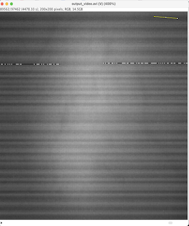
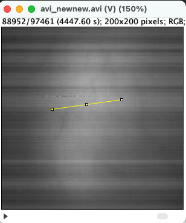

 
- **More than one row but clearly less than a block broken ('check pattern' 2-19 rows of pixels)**:

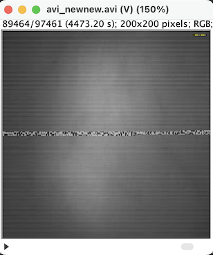
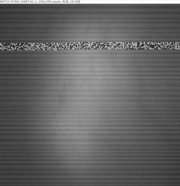

- **One block broken ('check-pattern' >19 rows of pixels)**:

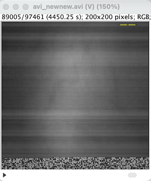
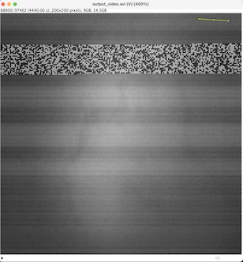

- **Several blocks brocken ('check pattern' distinctive blocks)**:

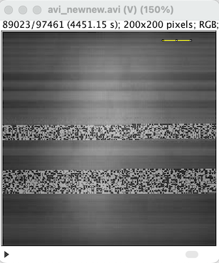
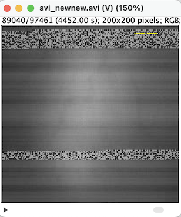

#### Black-out broken buffers:
Entirely black pixels

- **One block broken ('black-out')**:

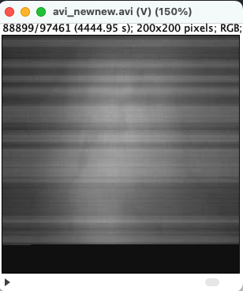
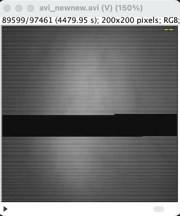

- **Majority of frame broken ('black-out')**:

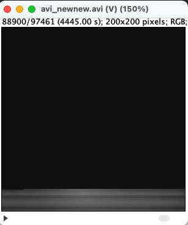

##
add parts for spaitial mask filtering of horizontal stripes
