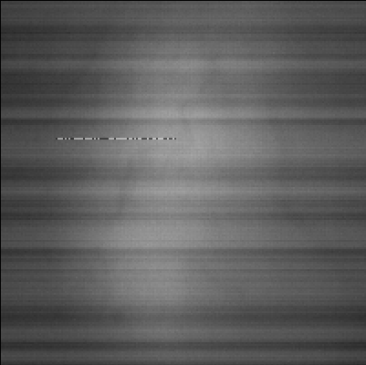
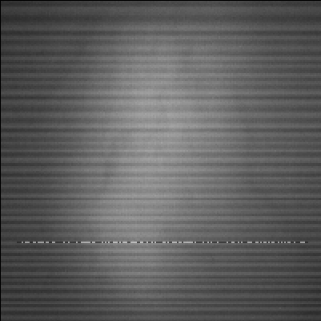
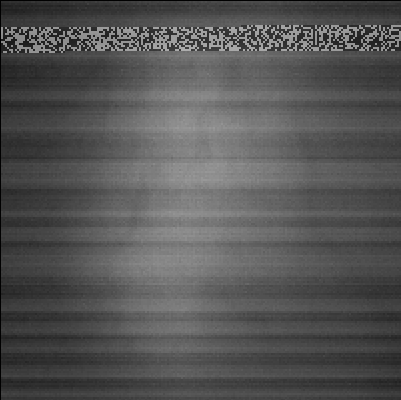
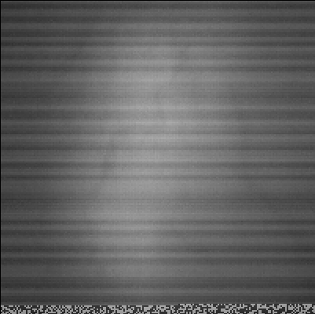
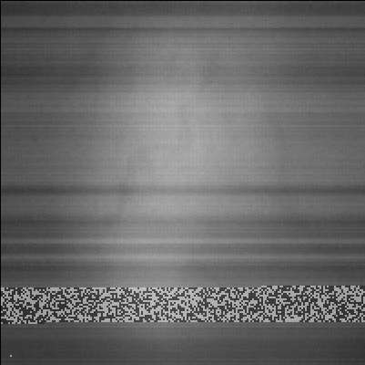
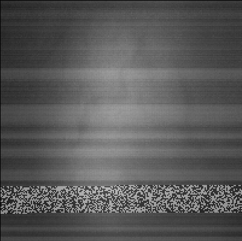
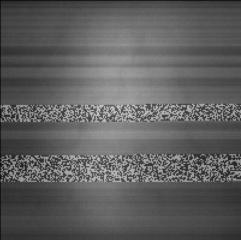
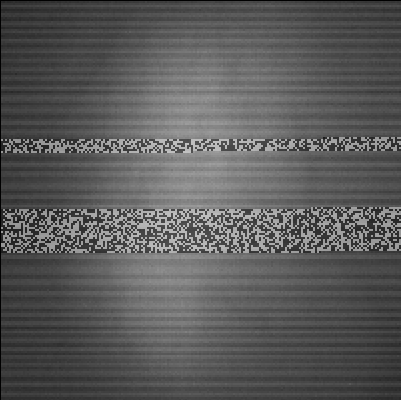
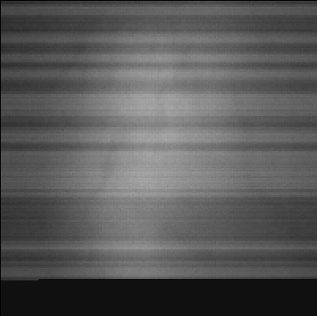
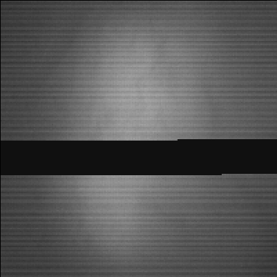

# preprocessing video files

## Filtering of frames with broken buffers (blocks of a frame) 

### Broken buffer detection methods:

- **Local Contrast Analysis**

    - The `_detect_with_gradient` function in `frame_helper.py` detects noise in video frames by analyzing local contrast.

    - second derivative in the **horizontal direction (x-axis)** is computed using `np.diff(block, n=2, axis=1)`, highlighting abrupt changes in pixel intensity across rows
        - more effective for spotting localized discontinuities compard to only using first derivative

    - Computes the absolute mean of the second derivative for each row.

    - If the mean contrast exceeds the noise detection threshold (`config.threshold`), the entire row is marked as noisy

    - binary mask is generated where noisy rows are assigned a value of `1`, indicating regions with broken buffers

Parameters:
- current_frame (np.ndarray): The grayscale frame to process (2D NumPy array).
- config (NoisePatchConfig): Configuration object containing the noise detection threshold.

Returns: Tuple[bool, np.ndarray]: 
- a boolean indicating whether the frame contains noise (`True` if any row is marked noisy).
- a binary noise mask of the same shape as `current_frame`, where noisy rows are set to `1`.

Example: If `config.threshold` is set to `5.0`, any block with a mean second 
        derivative value greater than `5.0` is considered a broken buffer.

### Types of buffer (blocks of a frame) errors 
for a 200x200 pixel frame

#### 1. Check-pattern
##### less than one row broken (<200 px)

##### several rows broken (2-19 rows of pixels)

##### one block broken (>19 rows of pixels)

##### several blocks broken

#### 2. Black-out pattern
##### one block broken (1-25 rows of pixels black)

##### majority of frame broken (more than 25 rows of a frame are black)

